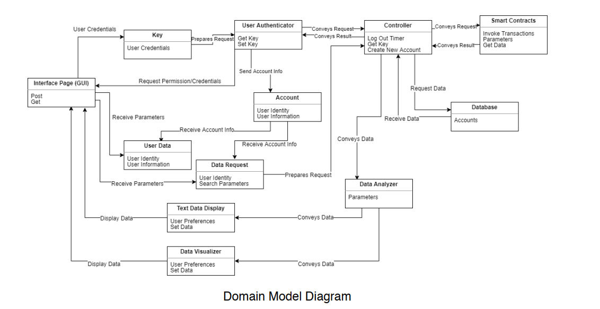

# Thành viên:
* Trần Ngọc Lâm (5*)
* Kiều Duy Nam (5*)
* Nông Ngọc Huân (5*)
* Mai Phúc Lâm (5*)
* Dương Đức Bình (5*)
* Đoàn Hữu Bách (5*)
# 6. Domain Analysis
## 6.a Domain Model
 
### i. Concept definitions
| Responsibility Description | Type | Concept Name | 
| :----- | :---------- | :-------------- | 
| Website with React pages for account log in, account creation, and viewing outcomes and results in UI made from Scalable vector graphics | K | User Interface (GUI)| 
| Form specifying the parameters for data retrieval from the blockchain, as well as parameters for desired data analysis. | K | Data Request | 
| Data input form where the user enters their health information | K | User Data | 
| Render non-graphical data and summaries in an organized way for user-requested data| D|  Text Data Display |
| Create data visualizations for the user-requested data| D| Data Visualizer |
| Establishes a connection to the Ethereum Blockchain. Accepts data requests and user data, and returns the raw data| D| Smart Contract   |
| Analyses the raw data for the requested measurements| D| Data Analyzer |
| Container for user’s authentication data (individual and third-party users)| K| Key  |
| Verifies that a user with appropriate credentials exists. If not, inform the user and proceeds accordingly. Obtain permission for third-party login.| D| User Authenticator |
| Coordinate actions of system concepts and user requests. Responsible for data retrieval and transfer to concepts. Refresh data periodically and log out users after prolonged time| D| Controller |
| Holds account information of a specific user and provides complete flexibility in managing users own data.| K| Account  |
| Stores account data, user data and collaborates in all activities related to data visualization, administration and storage.| K,D| Database   |

### ii. Association definitions
| Concept Pair | Association Description | Association Name |
| :----- | :---------- | :-------------- |
| User-Interface (UI) <-> Key | User enters their login information or new user information on the UI | User Credentials |
| Key <-> Authenticator | The authenticator takes the user’s information and prepares verification request, which is sent to the controller. | Prepares Request |
| Authenticator <-> Controller | (1) Controller receives verification requests, used to invoke the appropriate smart contract. (2) Controller informs authenticator of successful login | (1) Conveys Request (2) Conveys result |
| Controller <-> Data Request | Controller receives a request for data. It prepares a formal data request | Prepares Request |
| Controller <-> User Data | Controller receives user data. It prepares a formal data upload request | Prepares Request |
| Controller <-> Smart Contracts | (1) Controller generates a request to invoke the appropriate smart contract for data retrieval. (2) Controller receives raw data from the blockchain | (1) Generates Request (2) Receive Data |
| Controller <-> Data Analyzer | Controller passes raw data to the data analyzer | Conveys Data |
| Analyzer <-> Data Visualizer | Analyzer passed processed data to be visualized | Conveys Data |
| Text Data Display <-> UserInterface| Display the non-graphical data in an organized way | Display Data |
| Data Visualizer <-> UserInterface| Display graphical data| Display Data |
| Controller <-> Database| (1) Controller generates a data retrieval/upload request (2) Controller receives data from the database| (1) Request Data  (2) Receive Data|
| Authenticator <-> Account| Once authenticated, user account data is stored in Account concept (from database)| Send Account Info |
| Account <-> Data Request| Data request receives account information to be passed along with the request| Receive Account Info |
| Account <-> User Data| User Data form receives account information to be passed along with the user data| Receive Account Info |

### iii. Attribute definitions
| Concept | Attributes | Attribute Description |
| :----- | :---------- | :-------------- |
| Data Visualizer | Set data | This is setter for the system where the data is converted into visual form to fetch to GUI |
| | Set user’s preference | This allows the data visualizer to be customized to each user’s taste | 
|Smart Contracts (Ethereum network) | Invoke a transaction | The server will the blockchain to add a new node in the common chain which typical occur when there is a new user or old user update their data |
| | Add parameters | This adds flexibility to the system as the administrator adjust the system based on the user’s preference | 
| | Get Data | An entry or interface between the server and the blockchain to extract the data for the user | 
| Authenticators | Get key | This is for the getter and setter for the front and back to authenticate and distinguish between the user and third party |

### iv. Traceability Matrix
| Domain Concepts | Login | Logout| Display | Compare | Data | Authozization | Register | Public Access | Input | Data Adminstratior | Notify |
| :---------- | :-------------- |:----- | :---------- | :-------------- | :----- | :---------- | :-------------- |:----- | :---------- | :-------------- | :---- |
| Controller | :---------- | :-------------- |:----- | :---------- | :-------------- | :----- | :---------- | :-------------- |:----- | :---------- | :-------------- |
| GUI        | :---------- | :-------------- |:----- | :---------- | :-------------- | :----- | :---------- | :-------------- |:----- | :---------- | :-------------- |
| Key        | :---------- | :-------------- |:----- | :---------- | :-------------- | :----- | :---------- | :-------------- |:----- | :---------- | :-------------- |
| Smart Contract | :---------- | :-------------- |:----- | :---------- | :-------------- | :----- | :---------- | :-------------- |:----- | :---------- | :-------------- |
| Authenicator | :---------- | :-------------- |:----- | :---------- | :-------------- | :----- | :---------- | :-------------- |:----- | :---------- | :-------------- |
|Website     | :---------- | :-------------- |:----- | :---------- | :-------------- | :----- | :---------- | :-------------- |:----- | :---------- | :-------------- |
|Server      | :---------- | :-------------- |:----- | :---------- | :-------------- | :----- | :---------- | :-------------- |:----- | :---------- | :-------------- |
| Data Request| :---------- | :-------------- |:----- | :---------- | :-------------- | :----- | :---------- | :-------------- |:----- | :---------- | :-------------- |
| Web Framework| :---------- | :-------------- |:----- | :---------- | :-------------- | :----- | :---------- | :-------------- |:----- | :---------- | :-------------- |
| Account | :---------- | :-------------- |:----- | :---------- | :-------------- | :----- | :---------- | :-------------- |:----- | :---------- | :-------------- |
| Credentials| :---------- | :-------------- |:----- | :---------- | :-------------- | :----- | :---------- | :-------------- |:----- | :---------- | :-------------- |
| Database | :---------- | :-------------- |:----- | :---------- | :-------------- | :----- | :---------- | :-------------- |:----- | :---------- | :-------------- |
| Data Visualization| :---------- | :-------------- |:----- | :---------- | :-------------- | :----- | :---------- | :-------------- |:----- | :---------- | :-------------- |
| Data Analyzer | :---------- | :-------------- |:----- | :---------- | :-------------- | :----- | :---------- | :-------------- |:----- | :---------- | :-------------- |
|Text Data Display | :---------- | :-------------- |:----- | :---------- | :-------------- | :----- | :---------- | :-------------- |:----- | :---------- | :-------------- |
## 6.b System Operation Contracts
## 6.c Mathematical Model
# 7. Interaction Diagram
# 8. 
